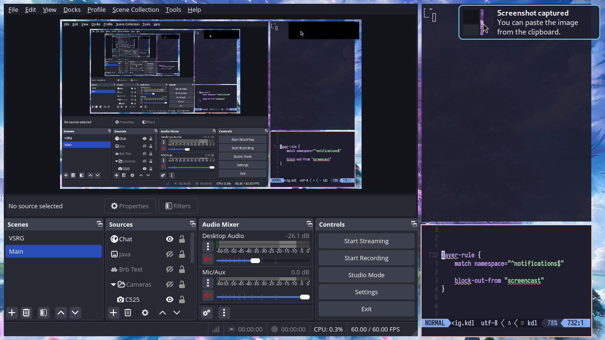

### Overview

<sup>Since: 1.0.0</sup>

Layer rules let you adjust behavior for individual layer-shell surfaces.
They have `match` and `exclude` directives that control which layer-shell surfaces the rule should apply to, and a number of properties that you can set.

Layer rules are processed and work very similarly to window rules, just with different matchers and properties.
Please read the [window rules wiki page](./Configuration:-Window-Rules.md) to learn how matching works.

Here are all matchers and properties that a layer rule could have:

```lua
return {
    layer_rules = {
        {
            match = {
                { namespace = "waybar" },
                { at_startup = true },
                { layer = "top" },
            },

            -- Properties that apply continuously.
            opacity = 0.5,
            block_out_from = "screencast",
            -- block_out_from = "screen-capture"

            shadow = {
                on = true,
                -- off = true
                softness = 40,
                spread = 5,
                offset = { x = 0, y = 5 },
                draw_behind_window = true,
                color = "#00000064",
                -- inactive_color = "#00000064"
            },

            geometry_corner_radius = 12,
            place_within_backdrop = true,

            background_effect = {
                xray = true,
                blur = true,
                noise = 0.05,
                saturation = 3,
            },

            popups = {
                opacity = 0.5,
                geometry_corner_radius = 6,

                background_effect = {
                    xray = true,
                    blur = true,
                    noise = 0.05,
                    saturation = 3,
                },
            },
        },
    },
}
```

### Layer Surface Matching

Let's look at the matchers in more detail.

#### `namespace`

This is a regular expression that should match anywhere in the surface namespace.
You can read about the supported regular expression syntax [here](https://docs.rs/regex/latest/regex/#syntax).

```lua
return {
    layer_rules = {
        {
            -- Match surfaces with namespace containing "waybar",
            match = { { namespace = "waybar" } },
        },
    },
}
```

You can find the namespaces of all open layer-shell surfaces by running `ymir msg layers`.

#### `at-startup`

Can be `true` or `false`.
Matches during the first 60 seconds after starting ymir.

```lua
return {
    layer_rules = {
        {
            -- Show layer-shell surfaces with 0.5 opacity at ymir startup, but not afterwards.
            match = { { at_startup = true } },
            opacity = 0.5,
        },
    },
}
```

#### `layer`

<sup>Since: 1.0.0</sup>

Matches surfaces on this layer-shell layer.
Can be `"background"`, `"bottom"`, `"top"`, or `"overlay"`.

```lua
return {
    layer_rules = {
        {
            -- Make overlay-layer surfaces slightly transparent.
            match = { { layer = "overlay" } },
            opacity = 0.9,
        },
    },
}
```

### Dynamic Properties

These properties apply continuously to open layer-shell surfaces.

#### `block-out-from`

You can block out surfaces from xdg-desktop-portal screencasts or all screen captures.
They will be replaced with solid black rectangles.

This can be useful for notifications.

The same caveats and instructions apply as for the [`block-out-from` window rule](./Configuration:-Window-Rules.md#block-out-from), so check the documentation there.



```lua
return {
    layer_rules = {
        {
            -- Block out mako notifications from screencasts.
            match = { { namespace = "^notifications$" } },
            block_out_from = "screencast",
        },
    },
}
```

#### `opacity`

Set the opacity of the surface.
`0.0` is fully transparent, `1.0` is fully opaque.
This is applied on top of the surface's own opacity, so semitransparent surfaces will become even more transparent.

Opacity is applied to every child of the layer-shell surface individually, so subsurfaces and pop-up menus will show window content behind them.

```lua
return {
    layer_rules = {
        {
            -- Make fuzzel semitransparent.
            match = { { namespace = "^launcher$" } },
            opacity = 0.95,
        },
    },
}
```

#### `shadow`

<sup>Since: 1.0.0</sup>

Override the shadow options for the surface.

These rules have the same options as the normal [`shadow` config in the layout section](./Configuration:-Layout.md#shadow), so check the documentation there.

Unlike window shadows, layer surface shadows always need to be enabled with a layer rule.
That is, enabling shadows in the layout config section won't automatically enable them for layer surfaces.

> [!NOTE]
> Layer surfaces have no way to tell ymir about their *visual geometry*.
> For example, if a layer surface includes some invisible margins (like mako), ymir has no way of knowing that, and will draw the shadow behind the entire surface, including the invisible margins.
>
> So to use ymir shadows, you'll need to configure layer-shell clients to remove their own margins or shadows.

```lua
return {
    layer_rules = {
        {
            -- Add a shadow for fuzzel.
            match = { { namespace = "^launcher$" } },
            shadow = { on = true },

            -- Fuzzel defaults to 10 px rounded corners.
            geometry_corner_radius = 10,
        },
    },
}
```

#### `geometry-corner-radius`

<sup>Since: 1.0.0</sup>

Set the corner radius of the surface.

This setting will only affect the shadow—it will round its corners to match the geometry corner radius.

```lua
return {
    layer_rules = {
        {
            match = { { namespace = "^launcher$" } },
            geometry_corner_radius = 12,
        },
    },
}
```

#### `place-within-backdrop`

<sup>Since: 1.0.0</sup>

Set to `true` to place the surface into the backdrop visible in the [Overview](./Overview.md) and between workspaces.

This will only work for *background* layer surfaces that ignore exclusive zones (typical for wallpaper tools).
Layers within the backdrop will ignore all input.

```lua
return {
    layer_rules = {
        {
            -- Put swaybg inside the overview backdrop.
            match = { { namespace = "^wallpaper$" } },
            place_within_backdrop = true,
        },
    },
}
```

#### `baba-is-float`

<sup>Since: 1.0.0</sup>

Make your layer surfaces FLOAT up and down.

This is a natural extension of the [April Fools' 2025 feature](./Configuration:-Window-Rules.md#baba-is-float).

```lua
return {
    layer_rules = {
        {
            -- Make fuzzel FLOAT.
            match = { { namespace = "^launcher$" } },
            baba_is_float = true,
        },
    },
}
```

#### `background-effect`

<sup>Since: 1.0.0</sup>

Override the background effect options for this surface.

- `xray`: set to `true` to enable the xray effect, or `false` to disable it.
- `blur`: set to `true` to enable blur behind this surface, or `false` to force-disable it.
- `noise`: amount of pixel noise added to the background (helps with color banding from blur).
- `saturation`: color saturation of the background (`0` is desaturated, `1` is normal, `2` is 200% saturation).

See the [window effects page](./Window-Effects.md) for an overview of background effects.

```lua
return {
    layer_rules = {
        {
            -- Make top and overlay layers use the regular blur (if enabled),
            -- while bottom and background layers keep using the efficient xray blur.
            match = {
                { layer = "top" },
                { layer = "overlay" },
            },
            background_effect = {
                xray = false,
            },
        },
    },
}
```

#### `popups`

<sup>Since: 1.0.0</sup>

Override properties for this layer surface's pop-ups (e.g. a menu opened by clicking an item in Waybar).

The properties work the same way as the corresponding layer-rule properties, except that they apply to the layer surface's pop-ups rather than to the layer surface itself.

`opacity` is applied *on top* of the layer surface's own opacity rule, so setting both will make pop-ups more transparent than the surface.
Other properties apply independently.

> [!NOTE]
> This block affects only pop-ups created by the app via Wayland's [xdg-popup](https://wayland.app/protocols/xdg-shell#xdg_popup) (which should be most of them).
>
> Some desktop shells will emulate pop-ups by drawing something that looks like a pop-up inside a regular layer surface.
> As far as ymir is concerned, those are just layer surfaces and not pop-ups, so this block won't apply to them.
>
> This block also does not affect input-method pop-ups, such as Fcitx.

```lua
return {
    layer_rules = {
        {
            -- Blur the background behind Waybar popup menus.
            match = { { namespace = "^waybar$" } },
            popups = {
                -- Match the default GTK 3 popup corner radius.
                geometry_corner_radius = 6,
                opacity = 0.85,

                background_effect = {
                    blur = true,
                },
            },
        },
    },
}
```

Keep in mind that the background effect will look right only if the pop-up is shaped like a (rounded) rectangle, and the layer surface correctly sets its Wayland geometry to exclude any shadows.
Pop-ups with custom shapes will need the app to implement the [ext-background-effect protocol](https://wayland.app/protocols/ext-background-effect-v1) to work properly.
